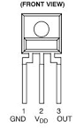

# SimpleSQM Sky Quality Meter

Based on the [DIY Sky Quality Meter](https://stargazerslounge.com/topic/366438-diy-sky-quality-meter/) by Daniel.

This is a simple Sky Quality Meter device, which uses the same TSL237 sensor as the original Unihedron SQM Meter. It communicates with its own ASCOM ObservingConditions driver, which you can install using `SimpleSQM Setup.exe`.

The circuit is extremely simple: just connect an Arduino Nano's `5V`, `GND` and `D8` pins to the TSL237 sensor. See below for the pinout. `5V` goes to `Vdd`, and `D8` to `OUT`.

Similarly to the Unihedron SQM Meter, you'll need to put a small IR filter and a 30° FoV lens in front of the TSL237 sensor. IR filters for CCTV cameras are good enough, and you can use 5mm LED lenses. All these parts can be easily bought from AliExpress.

Once everything is ready, connect the ASCOM driver to the Arduino Nano and you're good to go.
